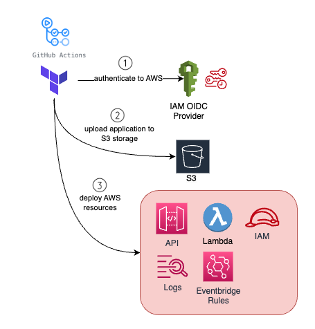

## CI/CD with Github Actions and AWS Web Identity Federation

Xplorersbot uses Github Actions for its CI/CD pipeline. With every push from every branch, unit tests will run and the workflow is defined in `.github/workflows/run-ci-tests.yml`.

Historically, applications running outside AWS had to rely on access and secret keys to access resources within AWS. However, as these secrets are long-lived credentials with permissions to interact and change the state of resources in AWS, they pose a security threat if not managed appropriately.

For this reason, AWS introduced [Web Identity Federation](https://docs.aws.amazon.com/IAM/latest/UserGuide/id_roles_providers_oidc.html) which allows you to delegate access to users outside of AWS to assume an IAM role in AWS. This is done by using an identity provider (IdP) that is compatible with OpenID Connect (OIDC) or SAML 2.0. The IdP authenticates the user and then issues an authentication response that contains assertions to the user's identity. The application then sends the authentication response to AWS STS to request temporary security credentials. The temporary security credentials are then returned to the application and used to access AWS resources.

Together, [Github Actions](https://github.com/features/actions) and Terraform are being leveraged to deploy XplorersBot to AWS once the changes have been tested and peer reviewed and merged to the mainline branch.

With every pull request merge to `main` branch, actions will automatically update the production environment by deploying to AWS (workflow `.github/workflows/deploy-xplorers-bot.yml`)

